# Turso Panic Fix Workflow

An automated system for reproducing, fixing, and shipping patches for panics discovered in the Turso database. Uses Claude Code agents orchestrated with AgentFS sandboxes for parallel, isolated execution.

## Table of Contents

- [Overview](#overview)
- [Architecture](#architecture)
- [Workflow](#workflow)
- [Database Schema](#database-schema)
- [Components](#components)
    - [Orchestrator](#orchestrator)
    - [MCP Tools](#mcp-tools)
    - [Agent Prompts](#agent-prompts)
- [AgentFS Integration](#agentfs-integration)
- [IPC: Timeout Tracking](#ipc-timeout-tracking)
- [Configuration](#configuration)
- [Error Handling](#error-handling)
- [Graceful Shutdown](#graceful-shutdown)

---

## Overview

The system processes panics from a database, each containing:
- Panic location (file:line)
- Panic message
- SQL statements that reproduce the panic

For each panic, the system:
1. Creates an isolated AgentFS sandbox with a pre-built Turso repo
2. Runs a **Reproducer Agent** to extend the simulator to trigger the panic
3. Runs a **Fixer Agent** to fix the bug and validate the fix
4. Opens a draft PR with the fix

All agents are Claude Code instances running in sandboxes, communicating through a shared context file (`panic_context.md`) and MCP tools.

---

## Architecture

```
┌─────────────────────────────────────────────────────────────────────┐
│                          Orchestrator                                │
│                          (TypeScript)                                │
├─────────────────────────────────────────────────────────────────────┤
│  • Workflow state machine                                            │
│  • Timeout management (with IPC for sim runtime exclusion)           │
│  • Spawns Claude Code agents via `agentfs run`                       │
│  • Manages sandbox lifecycle                                         │
│  • Database interactions (Turso)                                     │
│  • HTTP server for IPC (localhost:9100)                              │
│  • Graceful shutdown on SIGINT                                       │
└─────────────────────────────────────────────────────────────────────┘
         │                    │                    │
         ▼                    ▼                    ▼
   ┌───────────┐        ┌───────────┐        ┌───────────┐
   │  AgentFS  │        │  AgentFS  │        │  AgentFS  │
   │ sandbox-  │        │ sandbox-  │        │ sandbox-  │
   │  panic-001│        │  panic-002│        │  panic-003│
   ├───────────┤        ├───────────┤        ├───────────┤
   │ MCP Server│        │ MCP Server│        │ MCP Server│
   │ Claude CC │        │ Claude CC │        │ Claude CC │
   └───────────┘        └───────────┘        └───────────┘
         │                    │                    │
         └────────────────────┴────────────────────┘
                              │
                              ▼
                    ┌───────────────────┐
                    │   Base Turso Repo │
                    │   (pre-built)     │
                    └───────────────────┘
```

### Key Design Decisions

| Area | Decision |
|------|----------|
| Language | TypeScript |
| Agent runtime | Claude Code (CLI, `--dangerously-skip-permissions`) |
| Sandboxing | AgentFS CoW filesystems |
| Tool protocol | MCP servers (one per sandbox) |
| Tool communication | Tools return structured data, agent writes to context file |
| Git operations | Agents use git directly |
| IPC | HTTP callbacks for timeout tracking |
| Concurrency | Configurable, default 2 parallel panics |

---

## Workflow

```mermaid
%%{init: {'theme': 'dark', 'themeVariables': { 'primaryColor': '#4f46e5', 'primaryTextColor': '#fff', 'primaryBorderColor': '#818cf8', 'lineColor': '#94a3b8', 'secondaryColor': '#1e293b', 'tertiaryColor': '#0f172a', 'background': '#0f172a', 'mainBkg': '#1e293b', 'nodeBorder': '#4f46e5', 'clusterBkg': '#1e293b', 'titleColor': '#f8fafc', 'edgeLabelBackground': '#1e293b'}}}%%

flowchart TD
    subgraph PREFLIGHT["🛫 Pre-flight Checks"]
        PF1["Verify Turso repo at latest main"]
        PF2["Build project"]
        PF3{"make test<br/>passes?"}
        PF4["Fetch unresolved panic<br/>+ SQL statements"]
    end

    subgraph REPO_SETUP["🌿 Repo Setup"]
        RS1["Create branch:<br/>fix/panic-{id}"]
        RS2["Initialize context file:<br/>panic_context.md"]
        RS3["Create TCL test with<br/>failing SQL statements"]
        RS4{"make test-single<br/>fails with<br/>expected panic?"}
    end

    subgraph REPRODUCER["🔬 Reproducer Agent<br/><i>⏱️ 60min timeout (excludes sim runtime)</i>"]
        R1["Load context from .md file"]
        R2["Analyze panic pattern<br/>& triggering conditions"]
        R3["Extend simulator to<br/>generate statements"]
        R4{"Simulator<br/>compiles?"}
        R5["Run simulator"]
        R6{"Panic<br/>reproduced?"}
        R7["📝 Record failing seed"]
        R8["🔧 describe-sim-fix:<br/>• why simulator missed it<br/>• what was added"]
        R9["Update JSON block in .md file"]
        R10["📌 git commit:<br/>'reproducer: {panic_id}'"]
        RT{{"Timeout?"}}
    end

    subgraph FIXER["🔧 Fixer Agent<br/><i>⏱️ 60min timeout</i>"]
        F1["Load context from .md file"]
        F2["Analyze root cause"]
        F3["Implement fix"]
        F4{"Fix<br/>compiles?"}
        F4B["📌 git commit:<br/>'wip: fix compiles'"]
        F5["🔧 validate-fix (fast):<br/>• TCL test passes"]
        F6{"Fast gate<br/>passed?"}
        F7["🔧 validate-fix (slow):<br/>• make test passes<br/>• sim 10 runs pass"]
        F8{"Slow gate<br/>passed?"}
        F9["🔧 describe-fix:<br/>• bug description<br/>• fix description"]
        F10["Update JSON block in .md file"]
        F11["📌 git commit:<br/>'fix: {panic_id}'"]
        FT{{"Timeout?"}}
    end

    subgraph SHIP["🚀 Ship (Orchestrator)"]
        S1["Parse JSON block from .md file"]
        S2{"All required<br/>fields present?"}
        S3["Delete panic_context.md"]
        S4["Squash commits into single commit"]
        S5["Call open-pr tool:<br/>• draft PR<br/>• tag reviewer"]
        S6["Update DB:<br/>status = 'pr_open'"]
        S7["Delete sandbox"]
        S8(("✨ Done"))
    end

    subgraph ABORT["⛔ Abort"]
        AB1["Mark panic as<br/>needs_human_review<br/>+ add context"]
        AB2["Log warning:<br/>sandbox retained for debugging"]
        AB3(("🛑 Aborted"))
    end

    %% Pre-flight flow
    PF1 --> PF2 --> PF3
    PF3 -->|No| AB1
    PF3 -->|Yes| PF4

    %% Repo setup flow
    PF4 --> RS1 --> RS2 --> RS3 --> RS4
    RS4 -->|No| AB1
    RS4 -->|Yes| R1

    %% Reproducer agent flow
    R1 --> R2 --> R3 --> R4
    R4 -->|No| RT
    RT -->|No<br/>retry| R3
    RT -->|Yes| AB1
    R4 -->|Yes| R5 --> R6
    R6 -->|No| RT
    R6 -->|Yes| R7 --> R8 --> R9 --> R10

    %% Fixer agent flow
    R10 --> F1 --> F2 --> F3 --> F4
    F4 -->|No| FT
    FT -->|No<br/>retry| F3
    FT -->|Yes| AB1
    F4 -->|Yes| F4B --> F5 --> F6
    F6 -->|No| F2
    F6 -->|Yes| F7 --> F8
    F8 -->|No| F2
    F8 -->|Yes| F9 --> F10 --> F11

    %% Ship flow (orchestrator)
    F11 --> S1 --> S2
    S2 -->|No| AB1
    S2 -->|Yes| S3 --> S4 --> S5 --> S6 --> S7 --> S8

    %% Abort flow
    AB1 --> AB2 --> AB3

    %% Next panic loop
    S8 -.->|"Next panic"| PF4
```



### Phase Summary

| Phase | Executor | Timeout | Description |
|-------|----------|---------|-------------|
| Pre-flight | Orchestrator | None | Verify base repo builds and passes tests |
| Repo Setup | Orchestrator | None | Create sandbox, branch, TCL test |
| Reproducer | Claude Code Agent | 60min (excludes sim) | Extend simulator to reproduce panic |
| Fixer | Claude Code Agent | 60min | Fix bug, validate, document |
| Ship | Orchestrator | None | Squash, open PR, cleanup |

---

## Database Schema

### `panic_fixes` Table

```sql
CREATE TABLE panic_fixes (
    id TEXT PRIMARY KEY,
    status TEXT DEFAULT 'pending',
    -- pending | repo_setup | reproducing | fixing | shipping | pr_open | needs_human_review
    
    panic_location TEXT NOT NULL,       -- e.g., "src/vdbe.c:1234"
    panic_message TEXT NOT NULL,        -- e.g., "assertion failed: pCur->isValid"
    sql_statements TEXT NOT NULL,       -- JSON array of SQL strings
    
    branch_name TEXT,                   -- e.g., "fix/panic-abc123"
    pr_url TEXT,                        -- Set after PR opened
    
    retry_count INTEGER DEFAULT 0,      -- Reset to 0 on each state transition
    workflow_error TEXT,                -- JSON: error info for human review
    
    created_at TIMESTAMP DEFAULT CURRENT_TIMESTAMP,
    updated_at TIMESTAMP DEFAULT CURRENT_TIMESTAMP
);
```

### `logs` Table

```sql
CREATE TABLE logs (
    payload JSONB NOT NULL
);
```

Log payload structure:
```json
{
  "panic_id": "abc123",
  "phase": "reproducer",
  "level": "info",
  "message": "Simulator compiled successfully",
  "timestamp": "2025-01-13T10:30:00Z",
  "metadata": {}
}
```

Query examples:
```sql
-- Get all errors for a panic
SELECT * FROM logs 
WHERE payload->>'panic_id' = 'abc123' 
  AND payload->>'level' = 'error';

-- Get reproducer phase logs
SELECT * FROM logs 
WHERE payload->>'panic_id' = 'abc123' 
  AND payload->>'phase' = 'reproducer';
```

---

## Components

### Orchestrator

```
orchestrator/
├── src/
│   ├── index.ts              # Entry point, CLI
│   ├── workflow.ts           # State machine
│   ├── agents.ts             # Claude Code spawning
│   ├── sandbox.ts            # AgentFS management
│   ├── database.ts           # Turso client
│   ├── ipc-server.ts         # HTTP server for timeout tracking
│   ├── git.ts                # Git operations (squash, etc.)
│   ├── pr.ts                 # GitHub PR creation
│   ├── context-parser.ts     # Parse panic_context.md JSON block
│   ├── logger.ts             # Structured logging to DB
│   └── config.ts             # Configuration
├── package.json
└── tsconfig.json
```

#### State Machine

```typescript
type PanicStatus = 
  | 'pending'
  | 'repo_setup'
  | 'reproducing'
  | 'fixing'
  | 'shipping'
  | 'pr_open'
  | 'needs_human_review';

interface WorkflowState {
  panicId: string;
  status: PanicStatus;
  sandboxName: string;
  startTime: Date;
  pausedTime: number;  // Accumulated sim runtime (excluded from timeout)
}
```

#### Spawning Agents

```typescript
async function spawnAgent(
  sandboxName: string,
  promptFile: string,
  timeout: number
): Promise<AgentResult> {
  const proc = spawn('agentfs', [
    'run', sandboxName, '--',
    'claude',
    '--dangerously-skip-permissions',
    '--print', 'text',
    '--prompt', await readFile(promptFile, 'utf-8')
  ]);
  
  // Handle timeout (excluding paused time)
  // Handle stdout/stderr
  // Return result
}
```

### MCP Tools

```
tools/
├── src/
│   ├── server.ts             # MCP server entry
│   ├── run-simulator.ts      # Run simulator with seed
│   ├── describe-sim-fix.ts   # Document simulator changes
│   ├── describe-fix.ts       # Document bug fix
│   ├── validate-fix-fast.ts  # Run single TCL test
│   └── validate-fix-slow.ts  # Run full test suite + sim
├── package.json
└── tsconfig.json
```

#### Tool: `run-simulator`

```typescript
interface RunSimulatorParams {
  seed?: number;              // Optional: specific seed
  timeout_seconds?: number;   // Default: 300
}

interface RunSimulatorResult {
  panic_found: boolean;
  seed_used: number;
  panic_message?: string;
}

async function runSimulator(params: RunSimulatorParams): Promise<RunSimulatorResult> {
  const panicId = process.env.PANIC_ID;
  
  // Notify orchestrator: sim started
  await fetch(`http://localhost:9100/sim/${panicId}/started`, { method: 'POST' });
  
  try {
    const seed = params.seed ?? Math.floor(Math.random() * 1000000);
    const result = await exec(`./simulator --seed ${seed}`);
    
    return {
      panic_found: result.includes('PANIC'),
      seed_used: seed,
      panic_message: extractPanicMessage(result)
    };
  } finally {
    // Notify orchestrator: sim finished
    await fetch(`http://localhost:9100/sim/${panicId}/finished`, { method: 'POST' });
  }
}
```

#### Tool: `describe-sim-fix`

```typescript
interface DescribeSimFixParams {
  why_simulator_missed: string;
  what_was_added: string;
}

interface DescribeSimFixResult {
  success: boolean;
}

async function describeSimFix(params: DescribeSimFixParams): Promise<DescribeSimFixResult> {
  // Validate inputs
  if (!params.why_simulator_missed || !params.what_was_added) {
    return { success: false };
  }
  return { success: true };
}
```

#### Tool: `describe-fix`

```typescript
interface DescribeFixParams {
  bug_description: string;
  fix_description: string;
}

interface DescribeFixResult {
  success: boolean;
}

async function describeFix(params: DescribeFixParams): Promise<DescribeFixResult> {
  if (!params.bug_description || !params.fix_description) {
    return { success: false };
  }
  return { success: true };
}
```

#### Tool: `validate-fix-fast`

```typescript
interface ValidateFixFastResult {
  passed: boolean;
  error?: string;
}

async function validateFixFast(): Promise<ValidateFixFastResult> {
  const result = await exec('make test-single');
  return {
    passed: result.exitCode === 0,
    error: result.exitCode !== 0 ? result.stderr : undefined
  };
}
```

#### Tool: `validate-fix-slow`

```typescript
interface ValidateFixSlowParams {
  failing_seed: number;
}

interface ValidateFixSlowResult {
  passed: boolean;
  make_test_passed: boolean;
  sim_runs_passed: boolean;
  error?: string;
}

async function validateFixSlow(params: ValidateFixSlowParams): Promise<ValidateFixSlowResult> {
  // Run make test
  const makeResult = await exec('make test');
  if (makeResult.exitCode !== 0) {
    return {
      passed: false,
      make_test_passed: false,
      sim_runs_passed: false,
      error: makeResult.stderr
    };
  }
  
  // Run simulator 10 times on failing seed
  for (let i = 0; i < 10; i++) {
    const simResult = await runSimulator({ seed: params.failing_seed });
    if (simResult.panic_found) {
      return {
        passed: false,
        make_test_passed: true,
        sim_runs_passed: false,
        error: `Panic still occurs on run ${i + 1}`
      };
    }
  }
  
  return {
    passed: true,
    make_test_passed: true,
    sim_runs_passed: true
  };
}
```

### Agent Prompts

#### `prompts/reproducer.md`

```markdown
# Reproducer Agent

You are a Reproducer Agent working on the Turso database project. Your job is to extend the simulator so that it can generate SQL statements that trigger a specific panic.

## Context

Read the file `panic_context.md` in the repository root. It contains:
- The panic location and message
- The SQL statements that reproduce the panic
- A JSON block that you must update

Another agent (the Fixer) will use this file after you're done, so keep it well-organized.

## Your Task

1. **Analyze** the panic and the SQL statements that trigger it
2. **Extend the simulator** to generate similar statements
3. **Run the simulator** using the `run-simulator` tool until the panic is reproduced
4. **Record the failing seed** when you successfully reproduce the panic
5. **Call `describe-sim-fix`** to document:
   - Why the simulator didn't catch this panic before
   - What you added to make it generate the triggering statements
6. **Update the JSON block** in `panic_context.md` with:
   - `failing_seed`
   - `why_simulator_missed`
   - `simulator_changes`
7. **Commit your changes** with message: `reproducer: {panic_id}`

## Tools Available

- `run-simulator`: Run the simulator with an optional seed
- `describe-sim-fix`: Document your simulator changes

## Important

- Use git directly for all git operations
- The simulator is in `simulator/` directory
- Keep iterating until the panic is reproduced
- Do not modify the Turso database code, only the simulator
```

#### `prompts/fixer.md`

```markdown
# Fixer Agent

You are a Fixer Agent working on the Turso database project. Your job is to fix a panic that has been reproduced by the Reproducer Agent.

## Context

Read the file `panic_context.md` in the repository root. It contains:
- The panic location and message
- The SQL statements that reproduce the panic
- The failing simulator seed
- Information from the Reproducer about the simulator changes

## Your Task

1. **Analyze** the root cause of the panic
2. **Implement a fix** in the Turso codebase
3. **Commit** when it compiles with message: `wip: fix compiles`
4. **Validate (fast)** using `validate-fix-fast` - runs the single TCL test
5. **Validate (slow)** using `validate-fix-slow` - runs full test suite and simulator
6. **Call `describe-fix`** after validation passes to document:
   - What the bug was
   - How you fixed it
7. **Update the JSON block** in `panic_context.md` with:
   - `bug_description`
   - `fix_description`
8. **Commit your changes** with message: `fix: {panic_id}`

## Tools Available

- `validate-fix-fast`: Run single TCL test (fast iteration)
- `validate-fix-slow`: Run full test suite + simulator 10x (final validation)
- `describe-fix`: Document your fix

## Important

- Use git directly for all git operations
- If validation fails, analyze the failure and iterate on your fix
- Do not modify the simulator code, only the Turso database code
- The TCL test was created during Repo Setup and should pass after your fix
```

---

## AgentFS Integration

### Base Repo Setup (One-time)

```bash
# Clone and build Turso (this becomes the base layer)
git clone https://github.com/tursodatabase/turso /opt/turso-base
cd /opt/turso-base
cargo build
make test  # Verify it passes
```

### Sandbox Lifecycle

```typescript
// Create sandbox for a panic
async function createSandbox(panicId: string): Promise<string> {
  const sandboxName = `sandbox-${panicId}`;
  await exec(`agentfs create ${sandboxName} --base /opt/turso-base`);
  return sandboxName;
}

// Run command in sandbox
async function runInSandbox(sandboxName: string, command: string): Promise<ExecResult> {
  return exec(`agentfs run ${sandboxName} -- ${command}`);
}

// Delete sandbox
async function deleteSandbox(sandboxName: string): Promise<void> {
  await exec(`agentfs delete ${sandboxName}`);
}
```

### Spawning Claude Code in Sandbox

```typescript
async function spawnAgentInSandbox(
  sandboxName: string,
  promptFile: string
): Promise<void> {
  // Set up MCP server config in sandbox
  await runInSandbox(sandboxName, `
    claude mcp add panic-tools \\
      --scope project \\
      --transport stdio \\
      "npx tsx /opt/tools/server.ts"
  `);
  
  // Spawn Claude Code
  const prompt = await readFile(promptFile, 'utf-8');
  await exec(`
    PANIC_ID=${panicId} agentfs run ${sandboxName} -- \\
      claude \\
        --dangerously-skip-permissions \\
        --print text \\
        --prompt "${escapeForShell(prompt)}"
  `);
}
```

---

## IPC: Timeout Tracking

The orchestrator runs an HTTP server to track simulator runtime, which is excluded from agent timeouts.

### Orchestrator HTTP Server

```typescript
// ipc-server.ts
import express from 'express';

interface TimeTracker {
  startTime: Date;
  pausedAt?: Date;
  totalPausedMs: number;
}

const trackers = new Map<string, TimeTracker>();

const app = express();

app.post('/sim/:panicId/started', (req, res) => {
  const tracker = trackers.get(req.params.panicId);
  if (tracker && !tracker.pausedAt) {
    tracker.pausedAt = new Date();
  }
  res.sendStatus(200);
});

app.post('/sim/:panicId/finished', (req, res) => {
  const tracker = trackers.get(req.params.panicId);
  if (tracker && tracker.pausedAt) {
    tracker.totalPausedMs += Date.now() - tracker.pausedAt.getTime();
    tracker.pausedAt = undefined;
  }
  res.sendStatus(200);
});

export function getElapsedMs(panicId: string): number {
  const tracker = trackers.get(panicId);
  if (!tracker) return 0;
  
  const totalMs = Date.now() - tracker.startTime.getTime();
  const pausedMs = tracker.totalPausedMs + 
    (tracker.pausedAt ? Date.now() - tracker.pausedAt.getTime() : 0);
  
  return totalMs - pausedMs;
}

export function startTracking(panicId: string): void {
  trackers.set(panicId, {
    startTime: new Date(),
    totalPausedMs: 0
  });
}

export function stopTracking(panicId: string): void {
  trackers.delete(panicId);
}

app.listen(9100);
```

### Timeout Check

```typescript
const REPRODUCER_TIMEOUT_MS = 60 * 60 * 1000;  // 60 minutes
const FIXER_TIMEOUT_MS = 60 * 60 * 1000;       // 60 minutes

function checkTimeout(panicId: string, phase: 'reproducer' | 'fixer'): boolean {
  const elapsed = getElapsedMs(panicId);
  const limit = phase === 'reproducer' ? REPRODUCER_TIMEOUT_MS : FIXER_TIMEOUT_MS;
  return elapsed >= limit;
}
```

---

## Configuration

```typescript
// config.ts
export interface Config {
  // Database
  tursoUrl: string;
  tursoAuthToken: string;
  
  // AgentFS
  baseRepoPath: string;        // /opt/turso-base
  
  // Concurrency
  maxParallelPanics: number;   // Default: 2
  
  // Timeouts (milliseconds)
  reproducerTimeout: number;   // Default: 60 * 60 * 1000
  fixerTimeout: number;        // Default: 60 * 60 * 1000
  
  // GitHub
  githubToken: string;
  githubRepo: string;          // tursodatabase/turso
  prReviewer: string;          // Hard-coded reviewer username
  
  // IPC
  ipcPort: number;             // Default: 9100
}

export function loadConfig(): Config {
  return {
    tursoUrl: requireEnv('TURSO_URL'),
    tursoAuthToken: requireEnv('TURSO_AUTH_TOKEN'),
    baseRepoPath: process.env.BASE_REPO_PATH ?? '/opt/turso-base',
    maxParallelPanics: parseInt(process.env.MAX_PARALLEL ?? '2'),
    reproducerTimeout: parseInt(process.env.REPRODUCER_TIMEOUT ?? String(60 * 60 * 1000)),
    fixerTimeout: parseInt(process.env.FIXER_TIMEOUT ?? String(60 * 60 * 1000)),
    githubToken: requireEnv('GITHUB_TOKEN'),
    githubRepo: process.env.GITHUB_REPO ?? 'tursodatabase/turso',
    prReviewer: process.env.PR_REVIEWER ?? 'default-reviewer',
    ipcPort: parseInt(process.env.IPC_PORT ?? '9100')
  };
}
```

---

## Error Handling

### Error Categories

| Error Type | Behavior |
|------------|----------|
| Timeout | Abort immediately, no retry, flag `needs_human_review` |
| Claude Code crash | Abort, flag `needs_human_review` |
| AgentFS failure | Abort, flag `needs_human_review` |
| Compilation failure | Agent retries (within timeout) |
| Test failure | Agent retries (within timeout) |

### Abort Flow

```typescript
async function abort(panicId: string, error: Error, phase: string): Promise<void> {
  // Update database
  await db.execute({
    sql: `UPDATE panic_fixes 
          SET status = 'needs_human_review',
              workflow_error = ?,
              updated_at = CURRENT_TIMESTAMP
          WHERE id = ?`,
    args: [
      JSON.stringify({
        phase,
        error: error.message,
        timestamp: new Date().toISOString()
      }),
      panicId
    ]
  });
  
  // Log warning about retained sandbox
  await log({
    panic_id: panicId,
    phase,
    level: 'warn',
    message: `Sandbox retained for debugging: sandbox-${panicId}`,
    timestamp: new Date().toISOString()
  });
  
  // Stop tracking
  stopTracking(panicId);
}
```

---

## Graceful Shutdown

On SIGINT, the orchestrator:
1. Stops accepting new panics
2. Waits for in-flight agents to complete their current phase
3. Exits cleanly

```typescript
let shuttingDown = false;
const inFlightPanics = new Set<string>();

process.on('SIGINT', async () => {
  if (shuttingDown) {
    console.log('Force shutdown...');
    process.exit(1);
  }
  
  shuttingDown = true;
  console.log('Graceful shutdown initiated. Waiting for in-flight panics...');
  
  // Wait for all in-flight to complete
  while (inFlightPanics.size > 0) {
    await sleep(1000);
    console.log(`Waiting for ${inFlightPanics.size} panic(s)...`);
  }
  
  console.log('Shutdown complete.');
  process.exit(0);
});

// In main loop
async function processNextPanic(): Promise<void> {
  if (shuttingDown) return;
  
  const panic = await fetchNextPanic();
  if (!panic) return;
  
  inFlightPanics.add(panic.id);
  try {
    await runWorkflow(panic);
  } finally {
    inFlightPanics.delete(panic.id);
  }
}
```

---

## Context File Format

### `panic_context.md`

```markdown
# Panic Context: {panic_id}

## Panic Info
- **Location**: src/vdbe.c:1234
- **Message**: assertion failed: pCur->isValid

## SQL Statements
```sql
CREATE TABLE t1(a INTEGER PRIMARY KEY, b TEXT);
INSERT INTO t1 VALUES(1, 'test');
SELECT * FROM t1 WHERE a = 1;
```

## Reproducer Notes
<!-- Reproducer agent writes analysis here -->

## Fixer Notes
<!-- Fixer agent writes analysis here -->

---

## PR Data (Machine Readable)

```json
{
  "panic_id": "abc123",
  "panic_location": "src/vdbe.c:1234",
  "panic_message": "assertion failed: pCur->isValid",
  "failing_seed": 42,
  "why_simulator_missed": "...",
  "simulator_changes": "...",
  "bug_description": "...",
  "fix_description": "...",
  "tcl_test_file": "test/panic_abc123.test"
}
```
```

### Required Fields for Ship

| Field | Populated By |
|-------|--------------|
| `panic_id` | Repo Setup |
| `panic_location` | Repo Setup |
| `panic_message` | Repo Setup |
| `failing_seed` | Reproducer |
| `why_simulator_missed` | Reproducer (`describe-sim-fix`) |
| `simulator_changes` | Reproducer (`describe-sim-fix`) |
| `bug_description` | Fixer (`describe-fix`) |
| `fix_description` | Fixer (`describe-fix`) |
| `tcl_test_file` | Repo Setup |

The orchestrator extracts the JSON block via regex and validates all fields before opening the PR.

---

## Ship Phase Details

```typescript
async function ship(panicId: string, sandboxName: string): Promise<void> {
  // 1. Parse context file
  const contextPath = `panic_context.md`;
  const content = await runInSandbox(sandboxName, `cat ${contextPath}`);
  const prData = extractJsonBlock(content.stdout);
  
  // 2. Validate required fields
  const required = [
    'panic_id', 'panic_location', 'panic_message', 'failing_seed',
    'why_simulator_missed', 'simulator_changes', 'bug_description',
    'fix_description', 'tcl_test_file'
  ];
  for (const field of required) {
    if (!prData[field]) {
      throw new Error(`Missing required field: ${field}`);
    }
  }
  
  // 3. Delete context file
  await runInSandbox(sandboxName, `rm ${contextPath}`);
  
  // 4. Squash commits
  await runInSandbox(sandboxName, `
    git reset --soft $(git merge-base HEAD main) &&
    git commit -m "fix: ${prData.panic_message}

Location: ${prData.panic_location}
Bug: ${prData.bug_description}
Fix: ${prData.fix_description}

Failing seed: ${prData.failing_seed}
Simulator: ${prData.why_simulator_missed}"
  `);
  
  // 5. Push branch
  await runInSandbox(sandboxName, `git push -u origin fix/panic-${panicId}`);
  
  // 6. Open draft PR
  const prUrl = await openPullRequest({
    title: `fix: ${prData.panic_message}`,
    body: formatPrBody(prData),
    draft: true,
    reviewer: config.prReviewer
  });
  
  // 7. Update database
  await db.execute({
    sql: `UPDATE panic_fixes 
          SET status = 'pr_open', pr_url = ?, updated_at = CURRENT_TIMESTAMP
          WHERE id = ?`,
    args: [prUrl, panicId]
  });
  
  // 8. Delete sandbox
  await deleteSandbox(sandboxName);
}
```

---

## Directory Structure

```
turso-panic-fixer/
├── orchestrator/
│   ├── src/
│   │   ├── index.ts
│   │   ├── workflow.ts
│   │   ├── agents.ts
│   │   ├── sandbox.ts
│   │   ├── database.ts
│   │   ├── ipc-server.ts
│   │   ├── git.ts
│   │   ├── pr.ts
│   │   ├── context-parser.ts
│   │   ├── logger.ts
│   │   └── config.ts
│   ├── package.json
│   └── tsconfig.json
├── tools/
│   ├── src/
│   │   ├── server.ts
│   │   ├── run-simulator.ts
│   │   ├── describe-sim-fix.ts
│   │   ├── describe-fix.ts
│   │   ├── validate-fix-fast.ts
│   │   └── validate-fix-slow.ts
│   ├── package.json
│   └── tsconfig.json
├── prompts/
│   ├── reproducer.md
│   └── fixer.md
└── README.md
```